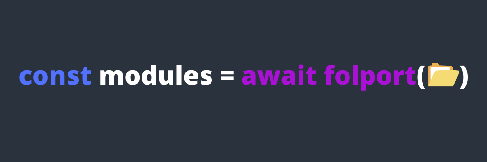

# Folport

[](https://github.com/gabrielrufino/folport/actions/workflows/ci.yml)
[](https://github.com/gabrielrufino/folport/actions/workflows/cd.yml)


Folport allows you to import all modules from a folder in a single step, organizing them in a clean and accessible way.

### Getting Started

To install, run this command:

```bash
npm install folport
```

### Important: Setting `"type": "module"`

Since Folport uses ES Modules (import/export syntax), you need to specify `"type": "module"` in your `package.json` file. This setting is essential to ensure Node.js interprets your code correctly as ES Modules.

```json
{
  "name": "your-project-name",
  "version": "1.0.0",
  "type": "module",
  "dependencies": {
    "folport": "^1.0.0"
  }
}
```

### Example

Suppose we have the following folder structure:

```
+-- math
|  +-- add.js
|  +-- subtract.js
|  +-- multiply.js
|  +-- divide.js
+-- index.js
```

#### index.js

```js
import { dirname, join } from 'path';
import { fileURLToPath } from 'url';

import folport from 'folport';

const __filename = fileURLToPath(import.meta.url);
const __dirname = dirname(__filename);

async function main() {
  const math = await folport(join(__dirname, 'math'))

  console.log(math.add(1, 2))      // 3
  console.log(math.subtract(8, 4)) // 4
  console.log(math.multiply(6, 7)) // 42
  console.log(math.divide(20, 10)) // 2
}

main()
```

---

**Black Tech by [Gabriel Rufino](https://github.com/gabrielrufino) 🖤**
